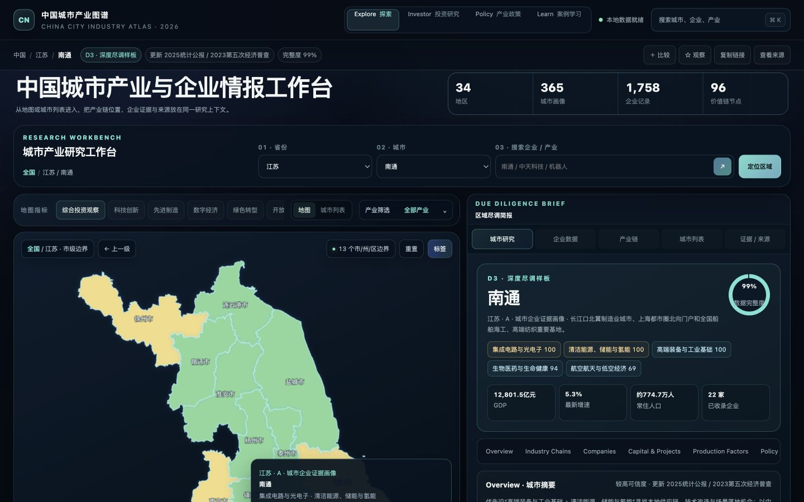

# 中国城市产业与龙头企业深度图谱 2026

**China City Industry & Enterprise Atlas 2026**

一套以“城市产业尽调”为主线的中国城市产业与企业情报平台。它使用同一套本地数据底座，为城市探索、投资研究、产业政策和案例学习提供四个相互连通的任务工作台，并把地图、城市指标、产业链、企业证据、来源与数据局限保留在同一研究上下文中。

> 先回答“这座城市靠什么增长”，再沿产业链核验“企业是谁、证据在哪里”。



## 项目定位 / What it is

传统区域产业地图往往停留在省级宏观叙述，或者把企业案例与城市产业链割裂展示。本项目采用“省份 → 城市 → 产业证据 → 企业 → 省域背景”的顺序，让城市成为研究主键：

- 进入城市后，优先显示城市定位和城市级经济指标；
- 每个重点产业同时展示产业数据、就业或主体口径与本地企业样本；
- 企业可以同时归属多条产业链，呈现跨链条作用；
- 365 个城市均至少收录一家本地登记或核心运营企业，不使用同省其他城市企业凑案例；
- 每座城市都有独立产业画像，并区分“本地企业证据”与“省域产业结构推导”；
- 集团员工、实时市值、历史估值和城市本地就业分别注明口径；
- 省域背景放在城市内容下方的折叠面板，避免抢占城市首屏。

This is a city-first industry and enterprise intelligence platform for China. Explore, Investor, Policy, and Learn modes share the same local data foundation, preserve the current city and industry context, and keep source provenance and data gaps visible throughout the research flow.

四类任务 / Four modes:

- **Explore / 探索**：地图与城市列表双入口，发现省份、城市、产业链和本地企业；
- **Investor / 投资研究**：比较城市与企业证据，并列展示 Bull、Bear、可信度和待核验事项；
- **Policy / 产业政策**：查看价值链缺口、异地招商候选、项目阶段和政策执行证据；
- **Learn / 案例学习**：使用真实城市样本解释指标，练习论点、反证和模拟配置。

## 当前数据覆盖 / Current coverage

| 维度                                                  | 覆盖 |
| ----------------------------------------------------- | ---: |
| 省级地区 / province-level regions                     |   34 |
| 城市与地区索引 / city and regional indexes            |  365 |
| 细分产业链 / value chains                             |   16 |
| 价值链节点 / value-chain nodes                        |   96 |
| 去重后企业记录 / deduplicated enterprise records       | 1,758 |
| 独立企业样本覆盖城市 / cities with enterprise records |  365 |
| 城市产业画像 / city due-diligence profiles             |  365 |
| A 股注册地样本 / A-share registered-city records       |  829 |
| 新三板挂牌样本 / NEEQ registered-city records          |  676 |
| 台湾公开发行样本 / TWSE public-company records         |   71 |
| 南通深度样本企业 / Nantong deep-dive enterprises      |   19 |

数据完整性由 `npm test` 自动检查，避免重构时意外丢失城市、企业或产业链记录。

## 南通深度样板 / Nantong deep dive

南通仍是量化统计和企业年报字段最完整的深度样板；其余 364 个城市也已建立企业证据驱动的结构化画像。南通覆盖：

- 先进封装与电子元器件；
- 船舶海工与深远海装备；
- 先进材料与绿色化工；
- 新能源装备与新型能源；
- 高端纺织与睡眠经济；
- 高端装备与工业母机。

代表企业包括中天科技、通富微电、江海股份、捷捷微电、帝奥微、通光线缆、海力风电、林洋能源、中国天楹、润邦股份、中远海运川崎、招商工业海门基地、惠生清洁能源、罗莱生活、梦百合、联发股份、泰慕士、江山股份和醋化股份。

每条企业记录可包含产业链角色、多个产业归属、上市代码、营收、集团员工、成立时间、所有制、背景说明和官方来源链接。非上市企业缺少可靠估值时不会填入传闻数字。

## V2.1 任务工作台 / Task-oriented workspace

V2.1 采用增量迁移，保留既有数据、离线地图和城市详情，并新增以下能力：

1. **四模式持续导航**：Explore、Investor、Policy、Learn 切换时保留当前城市、产业和企业。
2. **全局命令面板**：按 `/` 或 `Ctrl/Cmd + K` 搜索省份、城市、企业、代码、产业链节点、项目和政策；支持方向键、Enter 与 Escape。
3. **城市上下文栏**：持续显示省市面包屑、证据层级、更新时间、数据完整度、比较、观察、分享链接和来源入口。
4. **地图与列表等价入口**：ECharts、全国地图和 34 份省级边界均在本地；无法精准点击地图时仍可用键盘城市列表进入。
5. **专业企业数据表**：桌面端支持排序、筛选、列显隐、保存视图、CSV 导出和企业证据展开；手机端自动转换为卡片。
6. **任务型工作台**：投资者使用比较与 Bull/Bear，政策用户使用价值链缺口矩阵，学习用户使用案例和模拟配置。
7. **城市研究固定顺序**：摘要 → KPI → Overview → Industry Chains → Companies → Capital & Projects → Production Factors → Policy & Risks → Province Context → Sources。
8. **诚实的数据状态**：明确区分 Loading、Empty、Error、Low Confidence 和 Offline；没有结构化项目记录时不生成虚构项目。
9. **地图细节保留**：港澳固定入口、台湾 20 个县市下钻、市界点击、城市固定摘要卡和地图失败降级继续可用。
10. **响应式与无障碍**：390px 手机一次只显示一个主要工作面；对话框焦点恢复、可见焦点、ARIA 图表摘要和 reduced-motion 均有自动化验证。

## 核心功能 / Key features

- 全国省级地图与省内市级边界下钻；
- 四类任务工作台与持续上下文切换；
- 省份、城市、企业、股票代码、产业链节点、项目与政策的全局搜索；
- 投资观察、科技创新、先进制造、数字经济、绿色转型和开放枢纽指标；
- 16 条产业链筛选和 96 个价值链节点；
- 城市产业适配度与证据口径；
- 城市企业库的名称、业务、代码、产业和上市状态筛选；
- A 股实时总市值的联网尝试与失败回退；
- 城市与企业比较托盘、观察名单与可分享 URL 状态；
- 省域与城市指标比较图；
- 城市矩阵、全国趋势图表和原始来源跳转；
- 365 个城市的企业证据画像与风险提示；
- 地图边界加载失败时的选择器与快捷入口降级方案。

## 本地运行 / Run locally

项目是无构建步骤的静态网站。需要 Python 3 和现代浏览器。

```bash
git clone https://github.com/wang97870-creator/china-industry-atlas-2026.git
cd china-industry-atlas-2026
npm run serve
```

打开 [http://localhost:4175](http://localhost:4175)。

也可以使用任意静态服务器，例如 VS Code Live Server、`npx serve`、GitHub Pages、Netlify 或 Vercel。

核心地图、市级边界、图表库、城市画像和企业快照均保存在仓库内，可以离线浏览。只有 A 股实时市值刷新和外部原始来源跳转需要联网。

## 检查 / Validation

```bash
npm test
```

完整检查包括：

- `assets/data.js` 与 `assets/app.js` 的 JavaScript 语法；
- 34 个省级地区、365 个城市索引、365 份城市画像与 16 条产业链；
- 去重后 1,758 条企业记录、365/365 城市本地样本覆盖与南通 19 家企业；
- 34 份省级 GeoJSON 均可解析且包含可点击 Feature，台湾地图严格匹配 20 个县市；
- 核心 DOM、脚本加载顺序、许可证和商业授权文件。
- Playwright 关键流程：四模式、命令面板键盘流、URL 刷新/前进/后退、地图与城市列表、企业表格、比较限制和离线降级；
- 390×844、768×1024、1440×900、1920×1080 四类视口的溢出、字号与截图回归。

浏览器测试使用本机 Chrome；测试报告输出到 `docs/qa/playwright-report/`，前后对比截图位于 `docs/qa/baseline/` 与 `docs/qa/v21/`。

## 项目结构 / Project structure

```text
.
├── index.html                 # 页面结构与语义
├── assets/
│   ├── app.js                 # 地图、搜索、筛选与详情交互
│   ├── v21-app.js             # 四模式、命令面板、研究页与企业表格增量层
│   ├── data.js                # 省市、产业链、企业与来源数据
│   ├── generated/             # 交易所企业快照与 365 份城市画像
│   ├── maps/                  # 全国与 34 份省级本地 GeoJSON
│   ├── vendor/                # 本地 ECharts 运行时
│   ├── licenses/              # 第三方许可证与 CC0 声明
│   ├── styles.css             # 响应式视觉系统
│   ├── v21.css                # V2.1 语义 Token 与任务工作台样式
│   └── favicon.svg
├── scripts/                   # 企业快照、城市画像和台湾地图生成脚本
├── docs/                      # 迁移规格、质量门槛与 QA 证据
├── tests/
│   ├── smoke.mjs              # 零依赖完整性检查
│   └── v21.spec.mjs           # Playwright 关键交互与响应式检查
├── LICENSE
├── NOTICE.md
├── COMMERCIAL-LICENSE.md
├── CONTRIBUTING.md
└── THIRD_PARTY_NOTICES.md
```

## 数据与方法 / Data and methodology

项目优先引用：

- 国家统计局与地方统计公报；
- 工业和信息化部政策文件与产业平台；
- 第五次全国经济普查的地方公报；
- 上交所、深交所、港交所、巨潮资讯和企业投资者关系页面；
- 公司年度报告与官方背景资料。

产业评分表达区域与产业链的**结构性适配度**，不是企业估值、证券评级或收益预测。A/B 城市等级只表达数据颗粒度：

- **A**：有城市独立资料，或有多企业、多产业的本地证据；
- **B**：至少有一家本地企业证据，产业缺口由省域结构补充并明确标注。

实时市值是浏览器对公开行情接口的尽力获取，可能受跨域、网络、接口调整和交易时段影响。任何投资或项目决策都应重新核验最新公告和原始来源。

## 已知限制 / Known limitations

- 城市画像是企业证据驱动的研究入口，不能替代当地工商全量数据和项目级尽调；
- D3 深度样板目前仍是南通；其余城市按来源和字段完整度显示 D1/D2，不把相同颗粒度伪装为深度尽调；
- 融资与重大项目尚未形成覆盖全国的结构化数据集，缺失城市会显示明确空状态；
- 企业样本不代表城市全部企业，也不构成推荐名单；
- 集团员工人数通常不能直接推导为本地就业；
- 产业评分包含研究归纳，不是官方指数；
- 实时行情与外部原始来源离线时会降级；核心地图和图表仍可使用；
- 2026 年以后的统计、政策和企业数据需要持续更新。

## 路线图 / Roadmap

- 为更多城市补充统计公报、园区名录、细分财务和就业口径；
- 将人工核验记录迁移为更易审阅的模块化 JSON；
- 增加数据日期筛选、变更记录和来源健康检查；
- 扩充可核验的融资、重大项目、生产要素和政策执行结构化记录；
- 增加企业来源健康检查、城市数据版本、差异更新与多人协作；
- 为商业用户提供数据更新、定制城市包和私有部署方案。

## 许可说明 / License

本项目采用 [`PolyForm Noncommercial License 1.0.0`](LICENSE)。

这意味着源码可以公开查看，并可在许可证允许的范围内用于非商业目的、修改和分发；**商业用途不在默认授权范围内**。需要商业使用时，必须先取得单独的书面商业许可并支付相应费用，详见 [商业授权说明](COMMERCIAL-LICENSE.md)。

由于限制商业用途，本项目属于 **source-available（源码可见）**，不是 OSI 定义的 open-source software。公开 GitHub 仓库不等于放弃版权，也不等于允许免费商业使用。

This repository is source-available under the `PolyForm Noncommercial License 1.0.0`. Commercial use requires a separate paid written license. It is not OSI-approved open-source software because commercial use is restricted.

商业授权初步申请可使用仓库的 **Commercial license request** Issue 模板。创建 Issue 不代表已经取得授权。

## 贡献 / Contributing

欢迎提交数据勘误、来源补充和功能建议。为了保留项目所有者提供独立商业许可的能力，外部代码贡献目前需要先讨论并完成单独的贡献者协议。详见 [CONTRIBUTING.md](CONTRIBUTING.md)。

## 第三方项目 / Third-party software

页面使用本地 Apache ECharts；地图边界来自 DataV GeoAtlas、ChinaGeoJson 与 CC0 的 twgeojson 数据。第三方权利和许可不受本项目许可证替代，详见 [THIRD_PARTY_NOTICES.md](THIRD_PARTY_NOTICES.md)。

---

Built for city-level industry research, evidence tracing, and honest data-gap disclosure.
