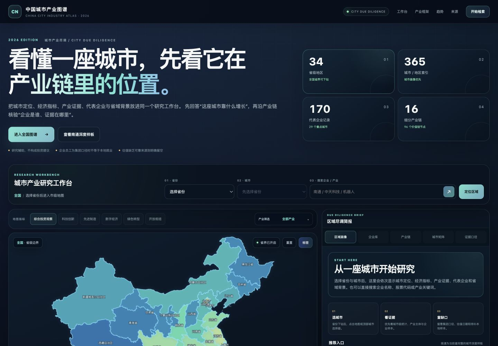

# 中国城市产业与龙头企业深度图谱 2026

**China City Industry & Enterprise Atlas 2026**

一个以“城市产业尽调”为主线的一页式区域研究工具。它把全国省市地图、城市定位、经济指标、细分产业链、代表企业、上市状态、营收与员工口径、数据来源和研究局限放在同一个工作台中。

> 先回答“这座城市靠什么增长”，再沿产业链核验“企业是谁、证据在哪里”。



## 项目定位 / What it is

传统区域产业地图往往停留在省级宏观叙述，或者把企业案例与城市产业链割裂展示。本项目采用“省份 → 城市 → 产业证据 → 企业 → 省域背景”的顺序，让城市成为研究主键：

- 进入城市后，优先显示城市定位和城市级经济指标；
- 每个重点产业同时展示产业数据、就业或主体口径与本地企业样本；
- 企业可以同时归属多条产业链，呈现跨链条作用；
- 缺少可靠本地企业时明确标记“本地样本待补”，不使用无关企业凑案例；
- 集团员工、实时市值、历史估值和城市本地就业分别注明口径；
- 省域背景放在城市内容下方的折叠面板，避免抢占城市首屏。

This is a city-first, single-page research workspace for understanding China's regional industries. It connects regional positioning, economic indicators, value-chain evidence, representative enterprises, source links, and explicit data gaps in one interface.

## 当前数据覆盖 / Current coverage

| 维度                                                  | 覆盖 |
| ----------------------------------------------------- | ---: |
| 省级地区 / province-level regions                     |   34 |
| 城市与地区索引 / city and regional indexes            |  365 |
| 细分产业链 / value chains                             |   16 |
| 价值链节点 / value-chain nodes                        |   96 |
| 代表企业记录 / enterprise records                     |  170 |
| 独立企业样本覆盖城市 / cities with enterprise records |   29 |
| 南通深度样本企业 / Nantong deep-dive enterprises      |   19 |

数据完整性由 `npm test` 自动检查，避免重构时意外丢失城市、企业或产业链记录。

## 南通深度样板 / Nantong deep dive

南通是当前颗粒度最完整的城市样板，覆盖：

- 先进封装与电子元器件；
- 船舶海工与深远海装备；
- 先进材料与绿色化工；
- 新能源装备与新型能源；
- 高端纺织与睡眠经济；
- 高端装备与工业母机。

代表企业包括中天科技、通富微电、江海股份、捷捷微电、帝奥微、通光线缆、海力风电、林洋能源、中国天楹、润邦股份、中远海运川崎、招商工业海门基地、惠生清洁能源、罗莱生活、梦百合、联发股份、泰慕士、江山股份和醋化股份。

每条企业记录可包含产业链角色、多个产业归属、上市代码、营收、集团员工、成立时间、所有制、背景说明和官方来源链接。非上市企业缺少可靠估值时不会填入传闻数字。

## 使用体验升级 / UX improvements

本版本在原始单文件图谱基础上完成了以下重构：

1. **更短的首屏路径**：压缩介绍区，桌面首屏即可看到研究工作台和地图。
2. **全国研究入口**：右侧默认显示操作步骤与重点城市入口，不再用随机省份占据初始详情。
3. **南通一键直达**：首页与全国入口均可直接打开南通深度样板。
4. **移动端双视图**：手机端提供“地图与筛选 / 城市详情”切换；选中城市后自动进入详情。
5. **城市优先信息层级**：城市定位 → KPI → 产业证据 → 企业 → 城市画像 → 省域背景。
6. **更易读的数据卡片**：提高字号、点击区域与对比度，减少 7–8px 的高密度文字。
7. **可访问性基础**：增加跳转链接、语义化标签、键盘焦点、ARIA 状态和 reduced-motion 支持。
8. **可维护的静态结构**：将 HTML、样式、数据和交互逻辑拆分，不再维护一个 200KB 以上的内联文件。

## 核心功能 / Key features

- 全国省级地图与省内市级边界下钻；
- 省份、城市、企业、股票代码与产业关键词搜索；
- 投资观察、科技创新、先进制造、数字经济、绿色转型和开放枢纽指标；
- 16 条产业链筛选和 96 个价值链节点；
- 城市产业适配度与证据口径；
- 城市企业库的名称、业务、代码、产业和上市状态筛选；
- A 股实时总市值的联网尝试与失败回退；
- 省域雷达对比；
- 城市矩阵、全国趋势图表和原始来源跳转；
- 地图边界加载失败时的选择器与快捷入口降级方案。

## 本地运行 / Run locally

项目是无构建步骤的静态网站。需要 Python 3 和现代浏览器。

```bash
git clone https://github.com/wang97870-creator/china-industry-atlas-2026.git
cd china-industry-atlas-2026
npm run serve
```

打开 [http://localhost:4175](http://localhost:4175)。

也可以使用任意静态服务器，例如 VS Code Live Server、`npx serve`、GitHub Pages、Netlify 或 Vercel。

地图、市级边界、图表库和实时市值功能需要联网。HTML、样式、城市/企业数据和不依赖外部请求的筛选逻辑均保存在仓库内。

## 检查 / Validation

```bash
npm test
```

检查内容包括：

- `assets/data.js` 与 `assets/app.js` 的 JavaScript 语法；
- 34 个省级地区、365 个城市索引、16 条产业链、170 条企业记录；
- 29 个企业样本城市与南通 19 家企业；
- 核心 DOM、脚本加载顺序、许可证和商业授权文件。

本版本还在真实浏览器中验证了桌面与手机布局、南通直达、城市自动切换、企业库 19/19 加载、企业名称过滤、手机返回地图以及浏览器控制台无错误。

## 项目结构 / Project structure

```text
.
├── index.html                 # 页面结构与语义
├── assets/
│   ├── app.js                 # 地图、搜索、筛选与详情交互
│   ├── data.js                # 省市、产业链、企业与来源数据
│   ├── styles.css             # 响应式视觉系统
│   └── favicon.svg
├── docs/
│   └── preview.png
├── tests/
│   └── smoke.mjs              # 零依赖完整性检查
├── LICENSE
├── NOTICE.md
├── COMMERCIAL-LICENSE.md
├── CONTRIBUTING.md
└── THIRD_PARTY_NOTICES.md
```

## 数据与方法 / Data and methodology

项目优先引用：

- 国家统计局与地方统计公报；
- 工业和信息化部政策文件与产业平台；
- 第五次全国经济普查的地方公报；
- 上交所、深交所、港交所、巨潮资讯和企业投资者关系页面；
- 公司年度报告与官方背景资料。

产业评分表达区域与产业链的**结构性适配度**，不是企业估值、证券评级或收益预测。A/B/C 城市等级只表达数据颗粒度：

- **A**：城市独立画像；
- **B**：省域基线叠加城市类型；
- **C**：行政边界派生画像。

实时市值是浏览器对公开行情接口的尽力获取，可能受跨域、网络、接口调整和交易时段影响。任何投资或项目决策都应重新核验最新公告和原始来源。

## 已知限制 / Known limitations

- 大部分城市仍是 B/C 颗粒度，不能替代当地项目级尽调；
- 企业样本不代表城市全部企业，也不构成推荐名单；
- 集团员工人数通常不能直接推导为本地就业；
- 产业评分包含研究归纳，不是官方指数；
- 外部 GeoJSON、图表 CDN 和行情接口离线时会降级；
- 2026 年以后的统计、政策和企业数据需要持续更新。

## 路线图 / Roadmap

- 为更多城市补充 A 级城市画像和本地企业样本；
- 将企业和城市数据迁移为更易审阅的模块化 JSON；
- 增加数据日期筛选、变更记录和来源健康检查；
- 增加城市并排对比与可分享研究链接；
- 提供可选的本地离线地图包；
- 为商业用户提供数据更新、定制城市包和私有部署方案。

## 许可说明 / License

本项目采用 [`PolyForm Noncommercial License 1.0.0`](LICENSE)。

这意味着源码可以公开查看，并可在许可证允许的范围内用于非商业目的、修改和分发；**商业用途不在默认授权范围内**。需要商业使用时，必须先取得单独的书面商业许可并支付相应费用，详见 [商业授权说明](COMMERCIAL-LICENSE.md)。

由于限制商业用途，本项目属于 **source-available（源码可见）**，不是 OSI 定义的 open-source software。公开 GitHub 仓库不等于放弃版权，也不等于允许免费商业使用。

This repository is source-available under the `PolyForm Noncommercial License 1.0.0`. Commercial use requires a separate paid written license. It is not OSI-approved open-source software because commercial use is restricted.

商业授权初步申请可使用仓库的 **Commercial license request** Issue 模板。创建 Issue 不代表已经取得授权。

## 贡献 / Contributing

欢迎提交数据勘误、来源补充和功能建议。为了保留项目所有者提供独立商业许可的能力，外部代码贡献目前需要先讨论并完成单独的贡献者协议。详见 [CONTRIBUTING.md](CONTRIBUTING.md)。

## 第三方项目 / Third-party software

页面运行时使用 Apache ECharts，并从 DataV GeoAtlas / ChinaGeoJson 获取地图边界。第三方权利和许可不受本项目许可证替代，详见 [THIRD_PARTY_NOTICES.md](THIRD_PARTY_NOTICES.md)。

---

Built for city-level industry research, evidence tracing, and honest data-gap disclosure.
